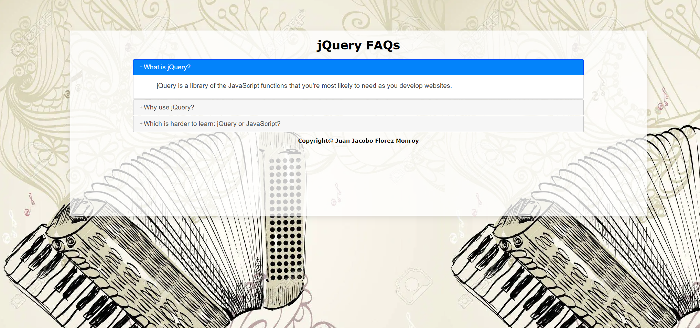

# 📚 FAQs - Interactive FAQ Page

## 📌 Project Overview

This project is an **interactive Frequently Asked Questions (FAQs) page** featuring a smooth accordion-style layout powered by **jQuery UI**. Users can click on questions to **reveal or hide answers with animated effects**.

Developed as a **college assignment**, this project demonstrates **JavaScript event handling, jQuery UI interactions, and CSS animations** to enhance UI/UX.

---

## 🚀 Features

- 🔽 **Accordion-style FAQs:** Expand and collapse sections interactively.
- 🎨 **Smooth Animations:** Uses jQuery UI for seamless transitions.
- 🖱️ **Click Event Handling:** Enhances interactivity using jQuery.
- 🎭 **Dynamic Header Animation:** The title changes color and size upon user interaction.
- 🌍 **Responsive Design:** Adapts perfectly to different screen sizes.

---

## 🎯 Project Purpose

This project was created as a **college assignment** to practice:

- ✅ **JavaScript DOM manipulation** using jQuery.
- ✅ **Event handling** for interactive elements.
- ✅ **CSS styling** for modern UI/UX.
- ✅ **Implementing jQuery UI components** effectively.

---

## 📂 Project Structure

```
📁 javascript_assignment_faqs
 ├── 📁 css/                # Stylesheets
 │   ├── jquery-ui.min.css  # jQuery UI styling
 ├── 📁 imgs/               # Image assets
 ├── 📁 js/                 # JavaScript files
 │   ├── faqs.js            # JavaScript logic for the FAQs accordion
 │   ├── jquery-ui.min.js   # jQuery UI library
 ├── 📄 index.html          # Main HTML file
```

---

## 🛠 Technologies Used

- **HTML5** → Structuring the webpage.
- **CSS3** → Styling, animations, and layout.
- **JavaScript (ES6+)** → Event handling and interactivity.
- **jQuery & jQuery UI** → Enabling accordion effects and animations.

---

## 📌 Prerequisites

To run the project, ensure you have:
- A **modern web browser** (Chrome, Firefox, Edge, etc.).
- **Internet access** (to load external libraries like jQuery if required).

---

## 🏃‍♂️ How to Use

1️⃣ **Open** `index.html` in a web browser.  
2️⃣ **Click** on any question to toggle answer visibility.  
3️⃣ **Observe** smooth animations and UI effects.  

---

## 📸 Screenshots  

| FAQs Accordion |  
|--------------|  
|  |  

---

## 📜 License

This project was developed for **educational purposes** as part of a college assignment.

---

## 💼 Author

👤 **Juan Jacobo Florez Monroy**  
🌐 **Portfolio**: [jjacobo95.com](https://jjacobo95.com)  
🐙 **GitHub**: [github.com/jjacoboflorez95](https://github.com/jjacoboflorez95)  