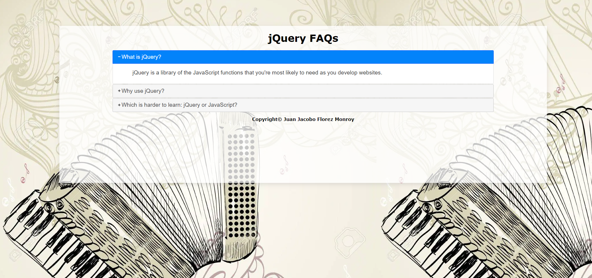

# 📚 FAQs

## 📌 Project Overview
This project is an interactive Frequently Asked Questions (FAQs) page designed with a smooth accordion-style layout using jQuery UI. Users can click on questions to reveal or hide answers with animated effects. Developed as a college assignment, this project focuses on enhancing JavaScript, jQuery UI, and CSS styling skills.

## 🚀 Features

- 🔽 **Accordion-style FAQs:** Expand and collapse sections interactively.
- 🎨 **Animated UI:** Smooth transitions for a seamless user experience.
- 🖱️ **Click Event Handling:** Uses jQuery to trigger interactive behaviors.
- 🎭 **Dynamic Header Animation:** The title dynamically changes color and size upon interaction.
- 🌍 **Responsive Design:** Fully adaptable to different screen sizes for an optimal experience.

## 📂 Project Structure

```
📁 javascript_assignment_faqs
 ├── 📁 css/                # Stylesheets
 │   ├── jquery-ui.min.css  # jQuery UI styling
 ├── 📁 imgs/             # Image assets
 ├── 📁 js/                 # JavaScript files
 │   ├── faqs.css           # Custom styling for the FAQs
 │   ├── jquery-ui.min.js   # jQuery UI library
 │   ├── faqs.js            # JavaScript logic for the FAQs accordion
 ├── 📄 index.html          # Main HTML file
```

## 🛠 Technologies Used

- **HTML5:** Structuring the webpage.
- **CSS3:** Styling, animations, and layout.
- **JavaScript (ES6+):** Event handling and interactive functionalities.
- **jQuery & jQuery UI:** Enabling accordion effects and smooth animations.

## 📌 Prerequisites

To run the project, ensure you have:
- A modern web browser (Chrome, Firefox, Edge, etc.).
- Internet access (to load external libraries like jQuery if required).

## 🏃‍♂️ How to Use

1️⃣ Open **index.html** in a web browser.  
2️⃣ Click on any question to toggle the answer visibility.  
3️⃣ Observe smooth animations and dynamic UI effects.  

## 🎯 Project Purpose
This project was developed as a college assignment to practice:

- JavaScript DOM manipulation using jQuery.
- Event handling for user interactions.
- CSS styling for improved UI/UX.
- Implementing jQuery UI components in a web project.

## 📸 Screenshots  

| FAQs Accordion |  
|--------------|  
|  |  

## 📜 License
This project was developed for educational purposes as part of a college assignment.

## 💼 Author
**Juan Jacobo Florez Monroy**  
🚀 **GitHub**: [GitHub](https://github.com/jjacoboflorez95)  

